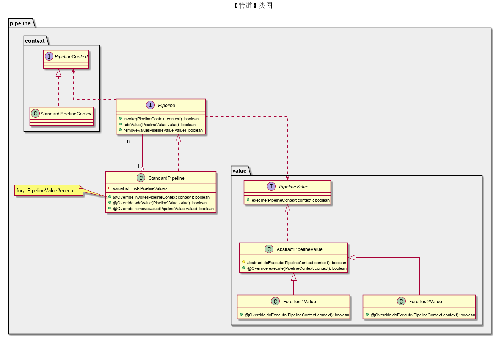
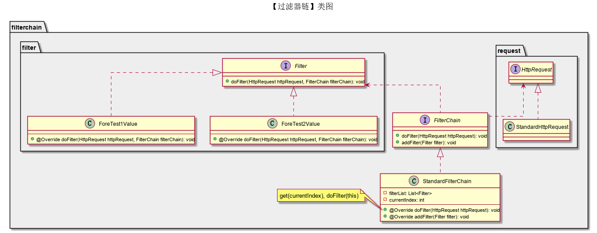
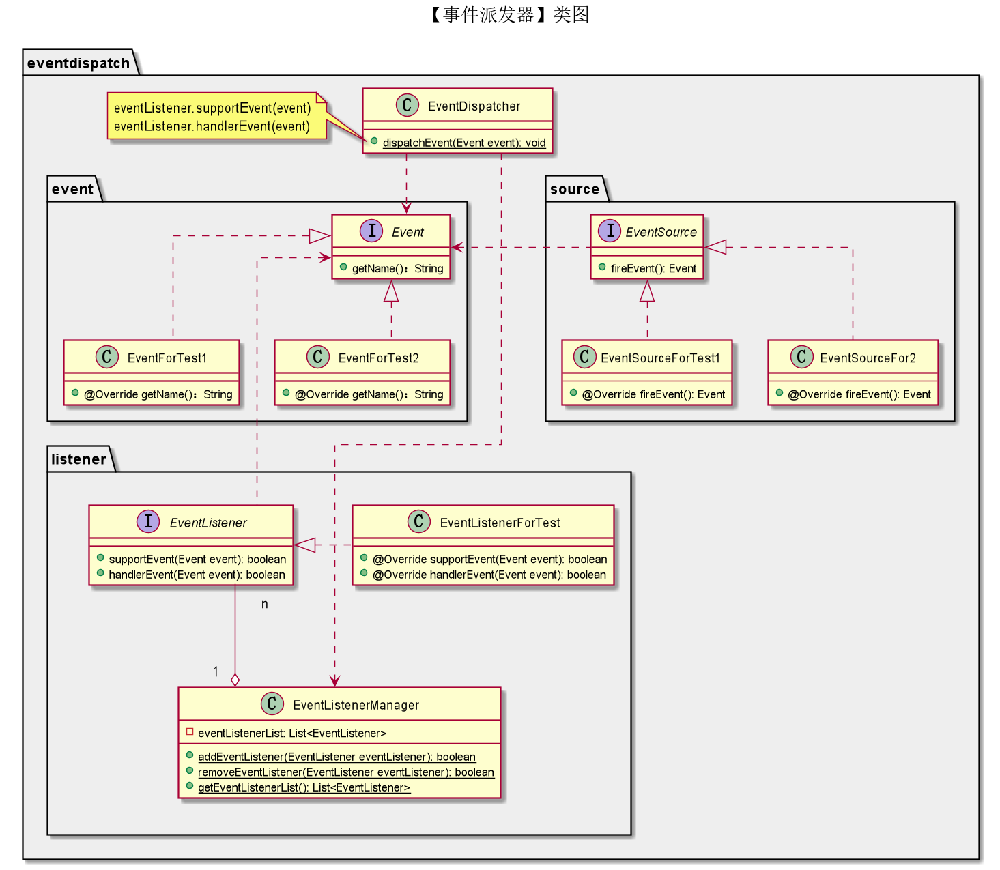
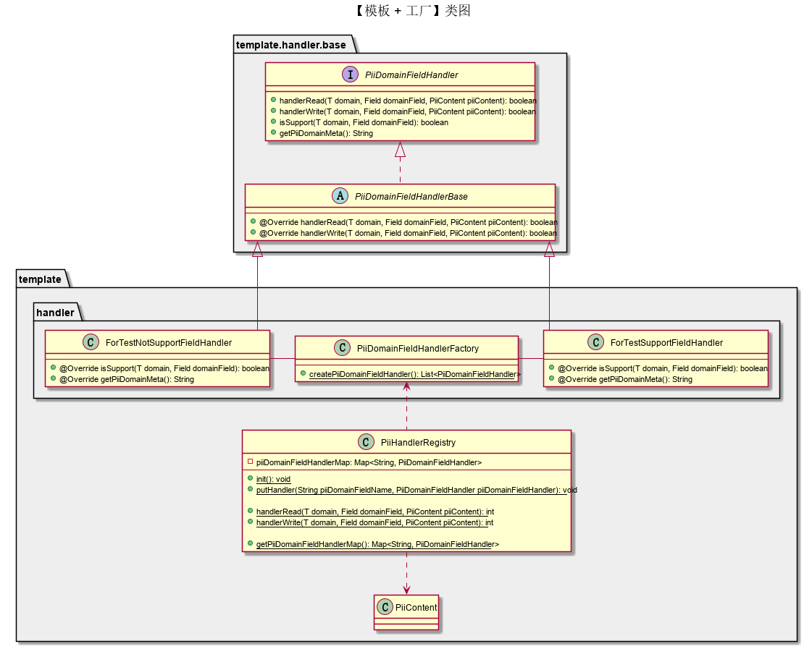

写在前面
---
工作中如何使用设计模式，你有什么套路？

设计模式扩展
---
保持代码扩展的几种方式。
- 管道模式

- 过滤器链模式

- 事件分发模式

- 模板 + 工厂模式

- SPI模式
- 注解模式
- ...

参考资料
---
https://blog.csdn.net/yunqiinsight/article/details/134694995

写在后面
--- 
如果本项目内容对您有价值或者有启发的话，欢迎点赞、fork、评论。如果您有一些疑问，欢迎探讨、批评指正。
